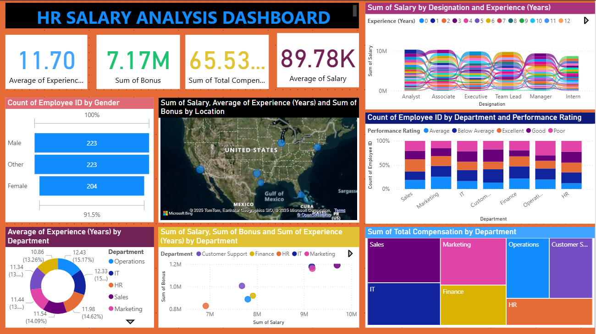

# 👨‍💼 HR Salary Analysis Dashboard (Power BI)

A comprehensive **Power BI project** designed to analyze HR salary structure, employee experience, performance rating, department trends, and compensation distribution.  
The project includes **two interactive dashboards** offering deep insights into workforce compensation and HR analytics.

---

## 🖼️ Dashboard Preview

### **📌 Dashboard 1**
.png)

### **📌 Dashboard 2**

---

## 🚀 Project Overview

This Power BI project helps HR teams and businesses understand:

- Employee salary distribution  
- Average experience across roles and departments  
- Bonus distribution  
- Total compensation trends  
- Salary-by-designation comparison  
- Salary vs. experience relationship  
- Gender-wise employee count  
- Performance rating distribution  

The dashboard is fully dynamic with interactive slicers for Experience, Gender, Department, and Performance Rating.

---

## 📌 Key Features

### ✔ **KPI Highlights**
- **Average Salary**  
- **Sum of Total Compensation**  
- **Average Experience (Years)**  
- **Sum of Bonus**  

### ✔ **Salary & Experience Analysis**
- Salary comparison by designation  
- Salary trends across experience years  
- Bonus-by-designation comparison  

### ✔ **HR Demographics**
- Gender distribution  
- Employee count by department  
- Performance rating bar chart  

### ✔ **Department Insights**
- Salary by department  
- Bonus by department  
- Total compensation treemap  

### ✔ **Geographical Insights (Dashboard 1)**
- Salary, bonus, and experience mapped by U.S. locations  

---

## 🛠 Tools & Technologies Used

| Tool / Technology | Purpose |
|------------------|---------|
| **Power BI Desktop** | Dashboard creation |
| **Power Query** | Data transformation |
| **DAX** | Calculated measures & KPIs |
| **Bing Maps** | Location-based salary visualization |

---

## 📂 Project Structure
📁 HR-Salary-Analysis
│── HR SALARY ANALYSIS DASHBOARD.pbix
│── HR SALARY ANALYSIS DASHBOARD.png
│── HR SALARY ANALYSIS DASH 1.png
│── README.md
└── dataset.csv 

## 🎯 Key Insights

- Senior roles (Manager, Executive) show higher salary and bonus ranges  
- Experience positively influences salary growth  
- Gender distribution is nearly balanced across departments  
- Departments like Sales and IT show top salary contribution  
- Associates contribute highest bonus among all designations  
- Compensation varies noticeably across U.S. locations  

---

## 📥 How to Use This Project

1. Download or clone the repository  
2. Open the `.pbix` file using **Power BI Desktop**  
3. Load or replace the dataset if required  
4. Use filters such as Experience, Gender, Department, and Performance Rating  
5. Explore both dashboards for complete HR analytics  

---

## 🔮 Future Enhancements

- Add Attrition Analysis (HR Analytics 2.0)  
- Add Predictive Modeling for salary forecasting  
- Include drill-through pages for employee-level details  
- Add AI-powered visuals like **Key Influencers**  
- Introduce **What-If parameters** for compensation planning  

